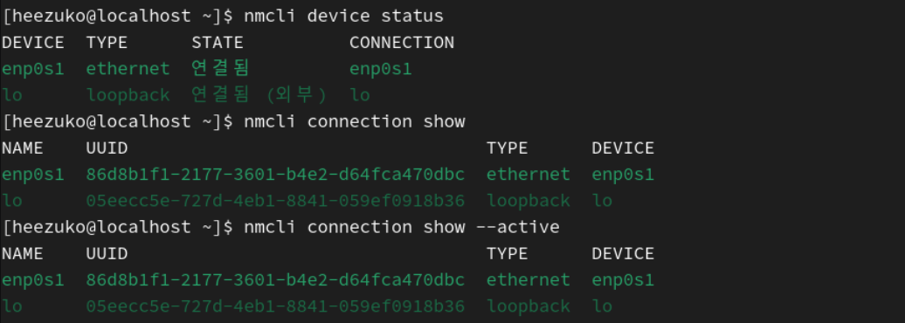
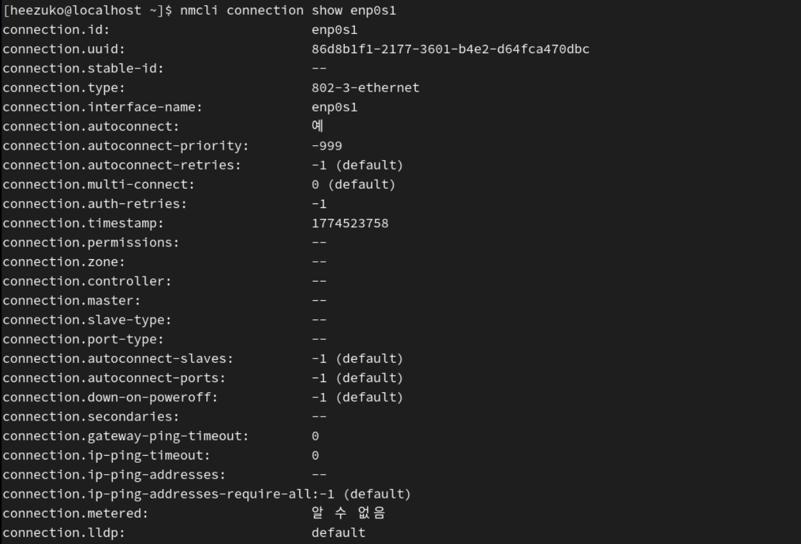
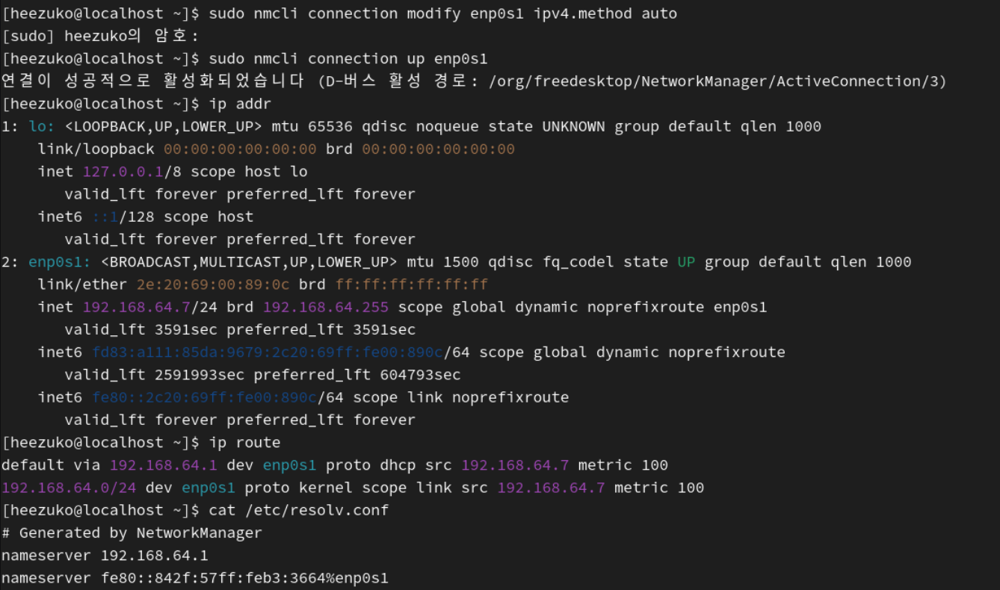
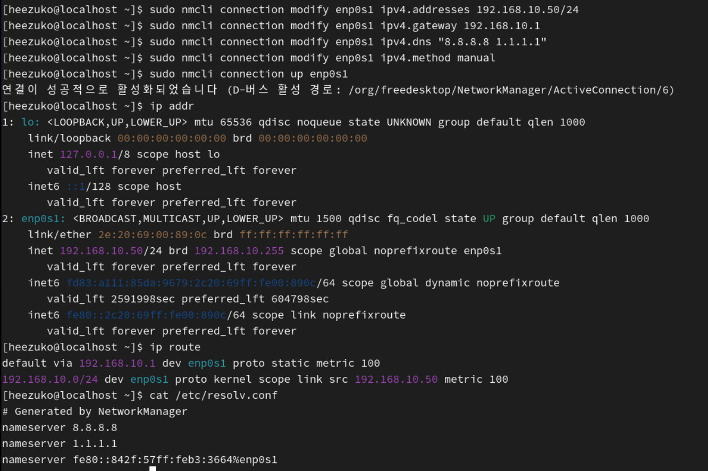
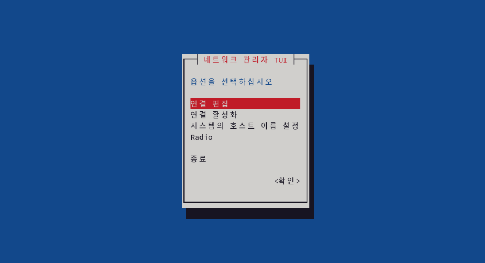
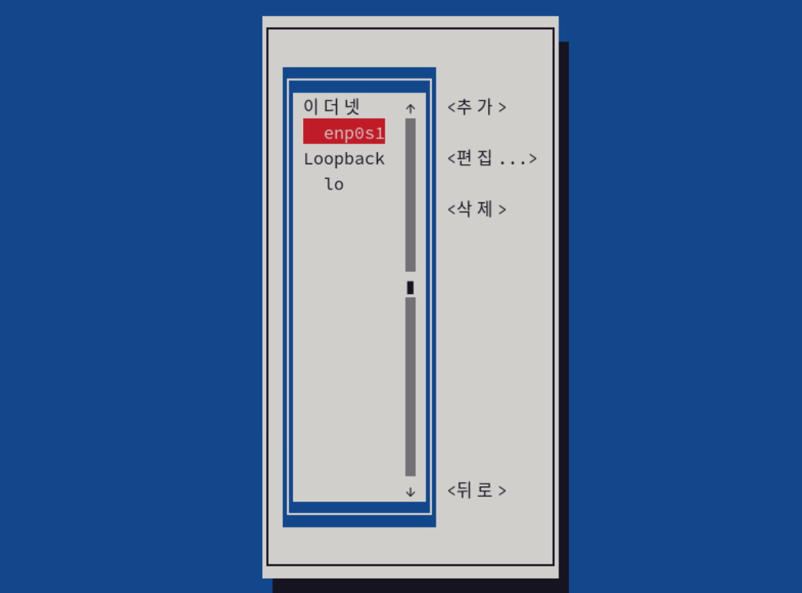

## nmcli·nmtui를 활용한 IP/게이트웨이/DNS 설정

### 1. NetworkManager

**리눅스 네트워크 설정을 통합적으로 관리하는 서비스**  
인터페이스, IP, 게이트웨이, DNS 등을 하나의 연결(Connection) 단위로 관리하고, CLI(`nmcli`) 또는 UI(`nmtui`)를 통해 설정 가능하다.

#### 1-1. nmcli vs nmtui

| 구분      | nmcli                           | nmtui           |
| --------- | ------------------------------- | --------------- |
| 방식      | 명령어                          | 텍스트 UI       |
| 특징      | 자동화 가능, 실무에서 많이 사용 | 초보자 친화적   |
| 사용 상황 | 서버, 스크립트, CI/CD           | 수동 설정, 실습 |

#### 1-2. device vs connection

1. device

- 물리적(또는 가상) NIC 자체
- np1s0, eth0 같은 인터페이스 이름이 곧 device!

2. connection (connection profile)

- device(인터페이스)에 적용할 네트워크 설정 묶음
- IP, 게이트웨이, DNS 등이 담김

☑️ 하나의 device에 여러 connection profile을 만들어둘 수 있고, 활성화(activate)된 profile 하나만 현재 device에 적용된다.

#### 1-3. 현재 네트워크 상태 확인

1. 장치 상태 확인
<pre>nmcli device status</pre>

- DEVICE: 네트워크 인터페이스 이름
- TYPE: 네트워크 인터페이스 타입
- STATE: 연결 상태
- CONNECTION: 연결 이름

2. 연결 목록 확인
<pre>nmcli connection show</pre>

3. 현재 활성 연결
<pre>nmcli connection show --active</pre>

- `enp0s1` 인터페이스가 현재 ethernet으로 네트워크에 정상 연결되어 있고, `enp0s1`이라는 connection 설정을 사용 중이다.
- enp0s1이라는 네트워크 설정이 있고, 이 설정은 enp0s1 인터페이스에 적용 가능하다.

4. 특정 연결 상세 보기
   <pre>nmcli connection show enp0s1</pre>
   

### 2. DHCP (자동 IP) 설정

**IP, 게이트웨이, DNS를 자동으로 받는 방식**

1. DHCP로 설정
<pre>sudo nmcli connection modify enp0s1 ipv4.method auto</pre>

2. 설정 적용
   <pre>sudo nmcli connection up enp0s1</pre>

   또는
   <pre>sudo nmcli device reapply enp0s1</pre>

3. 확인
   <pre>ip addr
   ip route
   cat /etc/resolv.conf</pre>
   

### 3. Static IP (고정 IP) 설정

예시 설정:

- IP: `192.168.10.50/24`
- 게이트웨이: `192.168.10.1`
- DNS: `8.8.8.8`, `1.1.1.1`

1. IP 설정
<pre>sudo nmcli connection modify enp0s1 ipv4.addresses 192.168.10.50/24</pre>
2. 게이트웨이 설정
<pre>sudo nmcli connection modify enp0s1 ipv4.gateway 192.168.10.1</pre>
3. DNS 설정
<pre>sudo nmcli connection modify enp0s1 ipv4.dns "8.8.8.8 1.1.1.1"</pre>
4. 수동 모드 설정
<pre>sudo nmcli connection modify enp0s1 ipv4.method manual</pre>
5. 적용
<pre>sudo nmcli connection up enp0s1</pre>
6. 확인
   <pre>ip addr
   ip route
   cat /etc/resolv.conf</pre>
   

### 4. DNS 설정

1. 자동 DNS 무시
<pre>sudo nmcli connection modify enp0s1 ipv4.ignore-auto-dns yes</pre>
2. 다시 자동 DNS 사용
<pre>sudo nmcli connection modify enp0s1 ipv4.ignore-auto-dns no</pre>
3. 부팅 시 자동 연결
<pre>sudo nmcli connection modify enp0s1 connection.autoconnect yes</pre>

### 5. 인터페이스 ON/OFF

1. 활성화
<pre>sudo nmcli device connect enp0s1</pre>
2. 비활성화
<pre>sudo nmcli device disconnect enp0s1</pre>

### 6. nmtui 사용법

1. 실행
   <pre>sudo nmtui</pre>
   
   

### ✚ 외부 통신 테스트 (`ping`)

<pre>ping -c 4 8.8.8.8
ping -c 4 google.com</pre>

- `-c 4`: ping 4번 보내고 자동 종료
  
