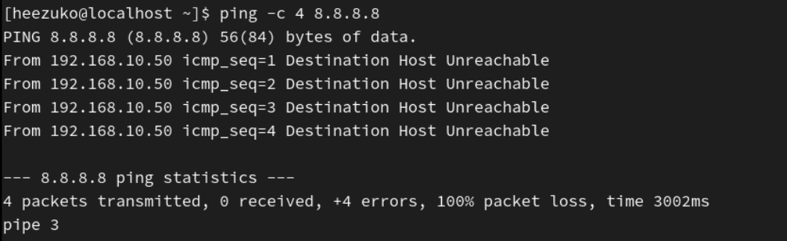
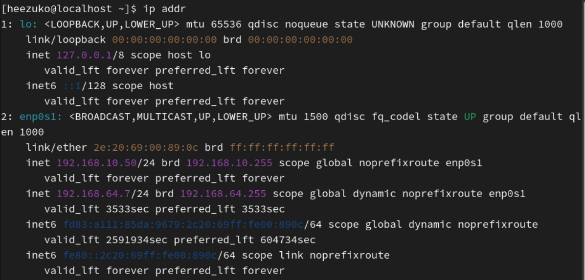
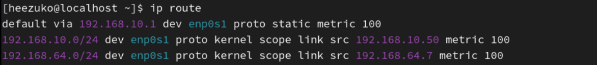
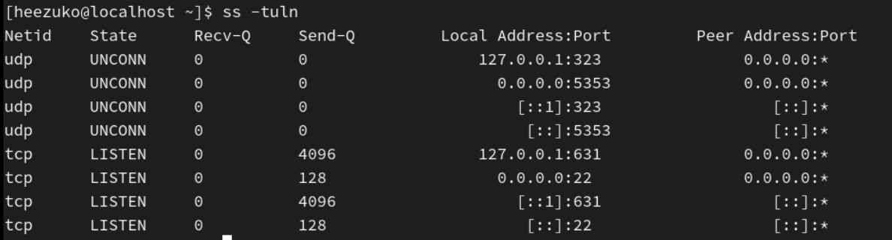
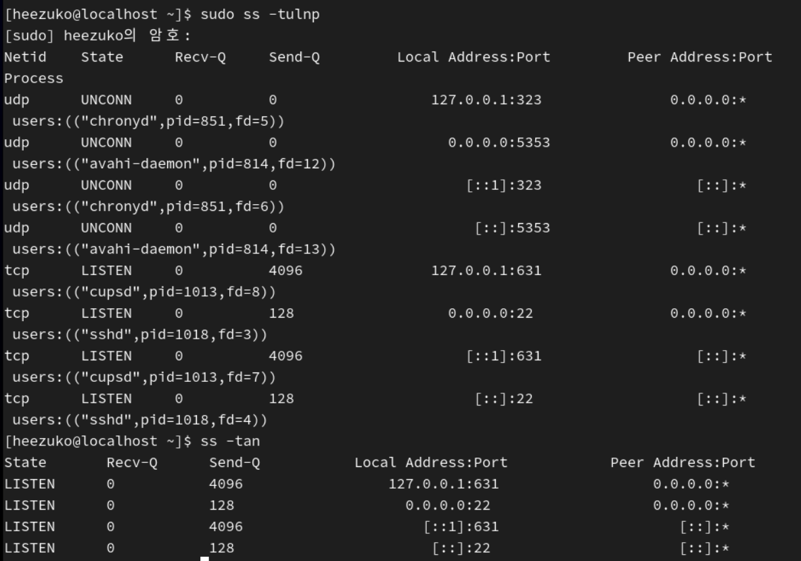

## 네트워크 상태 점검 도구 활용(ping, ss, ip)

리눅스에서 네트워크 문제를 해결하려면 단순히 설정만 하는 것이 아니라 현재 상태를 정확하게 확인하는 능력이 중요하다.

이를 위해 다음 도구들을 사용한다.

- `ping`: 네트워크 연결 확인
- `ip`: 인터페이스, IP, 라우팅 확인
- `ss`: 포트 및 소켓 상태 확인

### 1. 전체 디버깅 흐름

1. 인터페이스 살아있는가? → `ip link`
2. IP 정상인가? → `ip addr`
3. 게이트웨이 있는가? → `ip route`
4. 외부 통신 되는가? → `ping 8.8.8.8`
5. DNS 되는가? → `ping google.com`
6. 서비스 포트가 열려있는가? → `ss`

### 2. ping

**대상 호스트까지 패킷이 도달하는지 확인하는 가장 기본적인 도구**  
ICMP 프로토콜을 사용하여 요청/응답을 주고받는다.

#### 2-1. 기본 사용

<pre>ping 8.8.8.8</pre>

- IP 테스트 (인터넷 연결 확인)
- 기본은 무한 실행이기 때문에 `Ctrl+C`로 종료해야 함

#### 2-2. 횟수 제한

<pre>ping -c 4 8.8.8.8</pre>

- `-c`: count (횟수)
- 4번 보내고 자동 종료

#### 2-3. 도메인 테스트

<pre>ping -c 4 google.com</pre>

- 도메인 해석 확인 (DNS까지 포함한 테스트)

#### 2-4. 결과 해석

- `icmp_seq`: 패킷 번호
- `ttl`: 생존 시간 (라우터 통과 횟수)
- `time`: 응답 시간 (ms)
- `packet loss = 0%` → 정상
  - packet loss 높다면? → 네트워크 문제 가능성 O

### 3. ip

**네트워크 인터페이스, IP 주소, 라우팅 정보 등을 확인하고 관리하는 핵심 네트워크 명령어**  
시스템의 현재 네트워크 상태를 종합적으로 파악하는 데 사용된다.

#### 3-1. 인터페이스 확인

<pre>ip link</pre>

- 인터페이스 이름, 상태(IP/DOWN) 확인

#### ✚ 특정 인터페이스 확인

<pre>ip addr show enp0s1</pre>

#### 3-2. IP 주소 확인

<pre>ip addr</pre>
<pre>ip a</pre>

- IP 주소
- CIDR (`/24` 등)
- 인터페이스 연결 여부

#### 3-3. 라우팅 확인

<pre>ip route</pre>
<pre>ip r</pre>

- 기본 게이트웨이: `192.168.10.1`
- 인터페이스: `enp0s1

### 4. ss (socket statistics)

**현재 시스템에서 열려 있는 포트와 네트워크 소켓 상태를 확인하는 도구**  
TCP/UDP 연결 상태 및 서비스 포트 정보를 확인하는 데 사용된다.

#### 4-1. 기본 사용

<pre>ss -tuln</pre>

| 옵션 | 의미        |
| ---- | ----------- |
| -t   | TCP         |
| -u   | UDP         |
| -l   | LISTEN 상태 |
| -n   | 숫자로 표시 |

#### 4-2. 결과 해석

<pre>tcp  LISTEN   0      128     [::]:22         [::]:*</pre>

-> 22번 포트(SSH)가 열려 있음

#### 4-3. 프로세스 포함

<pre>sudo ss -tulnp</pre>

-> 어떤 프로그램이 포트를 사용하는지 확인

#### 4-3. 연결 상태 확인

<pre>ss -tan</pre>

상태 | 의미 |
----- | ---- |
LISTEN | 대기 중 |
ESTAB | 연결됨 |
TIME-WAIT | 종료 대기 |
