## 방화벽(firewalld) 및 SELinux

리눅스 시스템 보안은 크게 두 단계로 나눌 수 있다.

<pre>외부 → 방화벽(firewalld) → 내부 시스템 → SELinux</pre>

- **firewalld**: 외부에서 들어오는 **네트워크 접근**을 제어
  - 1차 방어선 (네트워크 차단)
- **SELinux**: 시스템 내부에서 **프로세스와 파일 접근**을 제어
  - 2차 방어선 (내부 접근 제한)

### 1. 방화벽(firewalld)

**네트워크 트래픽을 허용하거나 차단하는 보안 시스템**  
ex) SSH(22번 포트) 허용, HTTP(80) 허용, ...

#### 1-1. firewalld

- RHEL 기본 방화벽 관리 도구
- 리눅스의 방화벽은 커널에 포함된 Netfilter라는 서브 시스템으로 사용되며, 미리 지정된 규칙에 의해 패킷의 송/수신을 허용/차단하는 패킷 필터링 형태로 동작된다.
- -> Netfilter의 관리 인터페이스가 **firewalld**다!

**firewalld**는 방화벽 규칙을 **zone**이라는 형태로 묶어서 관리할 수 있음

#### 1-2. zone

**네트워크 신뢰 수준에 따른 정책 그룹**

| zone     | 설명                                                          |
| -------- | ------------------------------------------------------------- |
| public   | 기본적으로 최소한의 허용 규칙이 설정됨 (default)              |
| block    | 들어오는 패킷을 모두 거부 but 전송 패킷의 반환 통신은 허용    |
| dmz      | 일반적인 DMZ 인터페이스에 대한 설정에 사용                    |
| drop     | 모든 패킷 차단 but 전송 패킷의 반환 통신은 허용               |
| external | 특별히 매스커레이딩 규칙이 적용되는 외부릐 라우터를 위해 사용 |
| home     | 홈 영역(신뢰된 내부 네트워크)를 위해 사용                     |
| internal | 내부 네트워크 인터페이스에 대한 설정에 사용                   |
| trusted  | 거의 모든 통신 허용                                           |
| work     | 같은 회사 내부 네트워크를 위해 사용                           |

#### 1-3. firewalld 기본 설정

1. firewalld 상태 확인
   <pre>
   sudo systemctl status firewalld
   sudo firewall-cmd --state</pre>
   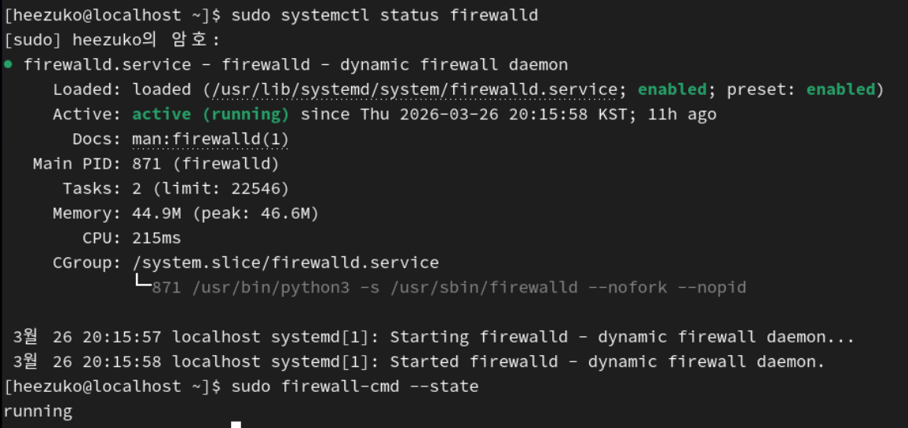

- Active가 running이면 정상

2. firewalld 기본 설정 확인
   <pre>sudo firewall-cmd --get-default-zone
   sudo firewall-cmd --get-active-zones
   sudo firewall-cmd --list-all</pre>
   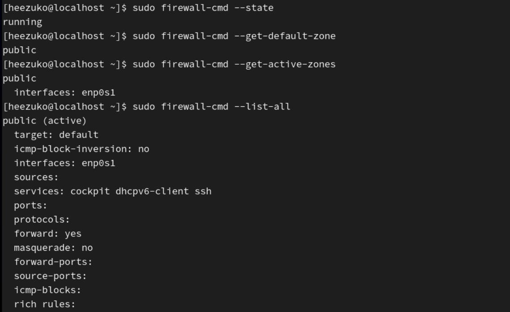

- 기본적으로 적용되는 방화벽 zone은 public임
- 현재 public zone이 활성 상태이며, enp0s1 인터페이스에 적용되어 있음
- 현재 active zone = public

#### 1-4. firewalld 관리

- 상태 확인 `systemctl status firewalld`
- 활성화 `systemctl enables firewalld`
- 비활성화 `systemctl disables firewalld`
- 시작 `systemctl start firewalld`
- 중지 `systemctl stop firewalld`
- 재시작 `systemctl restart firewalld`

#### 1-4. firewalld zone 관리

**[service 로 방화벽 허용 등록]**

1. 허용 서비스 목록 확인
<pre>sudo firewall-cmd --get-services</pre>

2. zone에 서비스 허용
<pre>
// http
sudo firewall-cmd --permanent --zone=public --add-service=http
// https
sudo firewall-cmd --permanent --zone=public --add-service=https
// dns
sudo firewall-cmd --permanent --zone=public --add-service=dns
</pre>

3. 서비스 삭제
<pre>
sudo firewall-cmd --permanent --zone=public --remove-service=https
</pre>

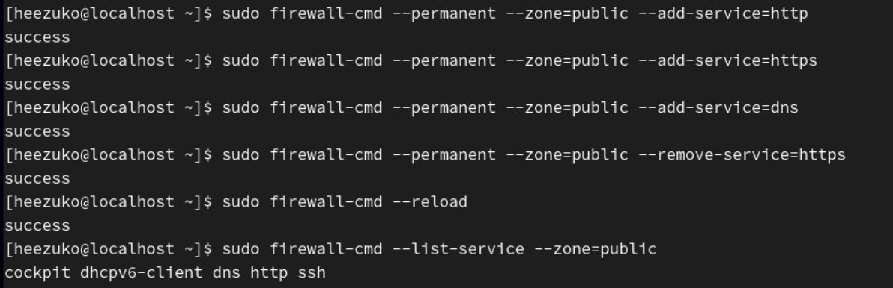

- http, https, dns 서비스 추가
- https 서비스 삭제
- 방화벽 재시작 및 확인

**[port로 방화벽 허용 등록]**

1. 허용 포트 리스트 확인
<pre>sudo firewall-cmd --list-port --zone=public</pre>

2. 특정 포트 추가
<pre>sudo firewall-cmd --permanent --zone=public --add-port=8080/tcp
sudo firewall-cmd --permanent --zone=public --add-port=8081/tcp</pre>

3. 특정 포트 삭제
<pre>sudo firewall-cmd --permanent --zone=public --remove-port=8081/tcp</pre>

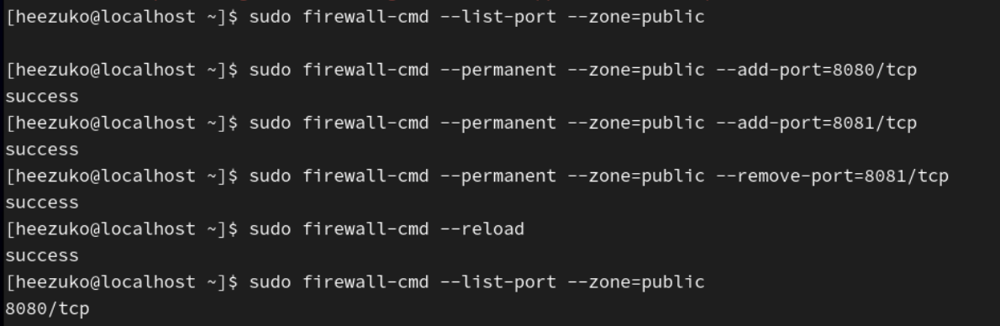

- TCP 8080, 8081 추가
- TCP 8081 삭제
- 방화벽 재시작 및 확인

**[IP 대역으로 방화벽 허용]**

1. 허용 IP 리스트 확인
<pre>sudo firewall-cmd --list-sources --zone=public</pre>

2. 허용 IP 추가
<pre>sudo firewall-cmd --permanent --zone=public --add-source=10.0.1.0/24
sudo firewall-cmd --permanent --zone=public --add-source=10.0.2.0/24</pre>

3. 허용 IP 삭제
<pre>sudo firewall-cmd --permanent --zone=public --remove-source=10.0.1.0/24</pre>

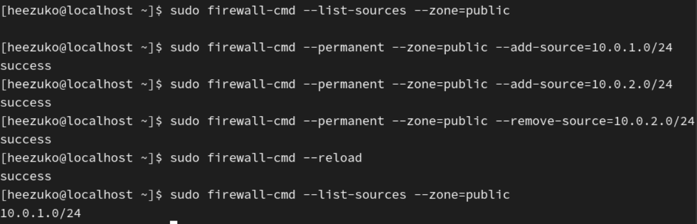

- `10.0.1.0/24`, `10.0.2.0/24` 추가
- `10.0.2.0/24` 삭제
- 방화벽 재시작 및 확인

**[xml 파일을 직접 수정]**

1. `/etc/firewalld/zones/` 경로에 있는 `public.xml` 파일의 내용 확인
<pre>sudo cat /etc/firewalld/zones/public.xml</pre>

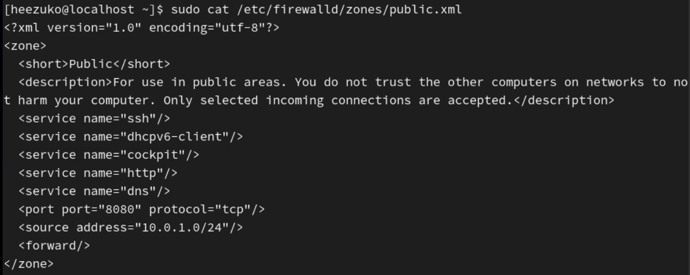
아까 추가한 것들이 허용되어 있음

- service: `http`, `dns`
- port: `TCP 8080`
- IP 주소: `10.0.1.0/24`

2. `public.xml` 파일을 vi 편집기로 열어 수정
   <pre>sudo vi /etc/firewalld/zones/public.xml</pre>

   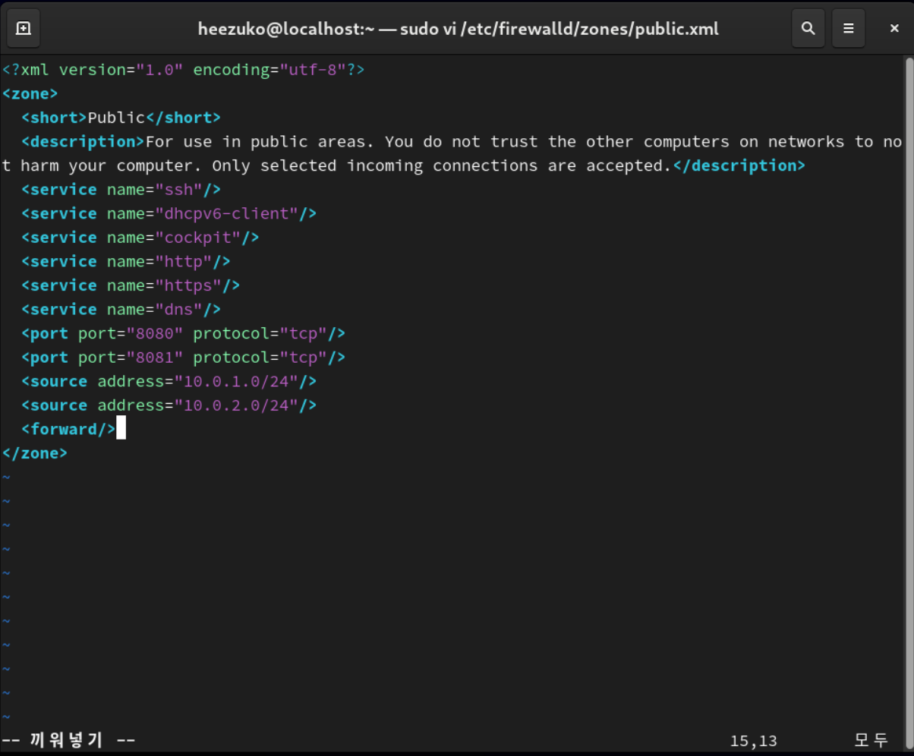

3. 방화벽 재시작 및 허용 리스트 확인
   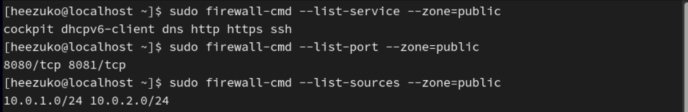

### 2. SELinux (Security Enhanced Linux)

**리눅스 시스템의 보안을 강화하기 위한 강제 접근 제어 시스템**  
기본 리눅스 권한(rwx, 소유자, 그룹)을 넘어서 프로세스가 어떤 파일과 자원에 접근할 수 있는지를 정책으로 강제 제한한다.

**필요한 이유?**  
파일 권한: 읽기 허용일 때 해킹된 프로세스가 접근하면? 기본 권한만으로는 막기 어렵다!
SELinux는 프로세스가 할 수 있는 행동 자체를 제한할 수 있다.  
ex) 웹 서버가 `/etc/shadow` 접근 못하게 제한 (특정 dir 접근 제한)

#### 2-1. SELinux 동작 원리

<pre>
사용자 요청
↓
리눅스 권한 검사 (rwx)
↓
SELinux 정책 검사
↓
허용 or 차단
</pre>

=> 권한이 있어도 SELinux가 막으면 접근 불가

#### 2-2. SELinux 상태

| 상태       | 설명                             |
| ---------- | -------------------------------- |
| Enforcing  | 강제 (차단)                      |
| Permissive | 허용 (차단하지 않고 로그만 기록) |
| Disabled   | 비활성화                         |

#### 2-3. 상태 확인 및 변경

- 상태 확인
  <pre>getenforce</pre>
  <pre>sestatus</pre>

- 상태 변경
    <pre>sudo setenforce 0   # permissive
  sudo setenforce 1   # enforcing</pre>

  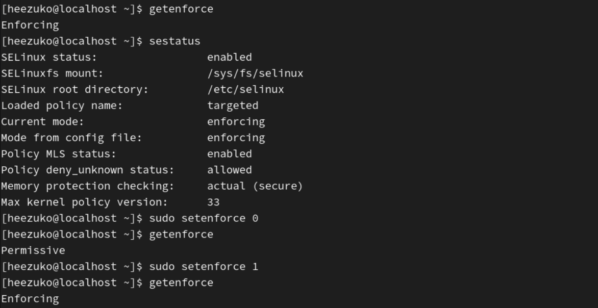

#### 2-4. 설정 파일

<pre>/etc/selinux/config</pre>

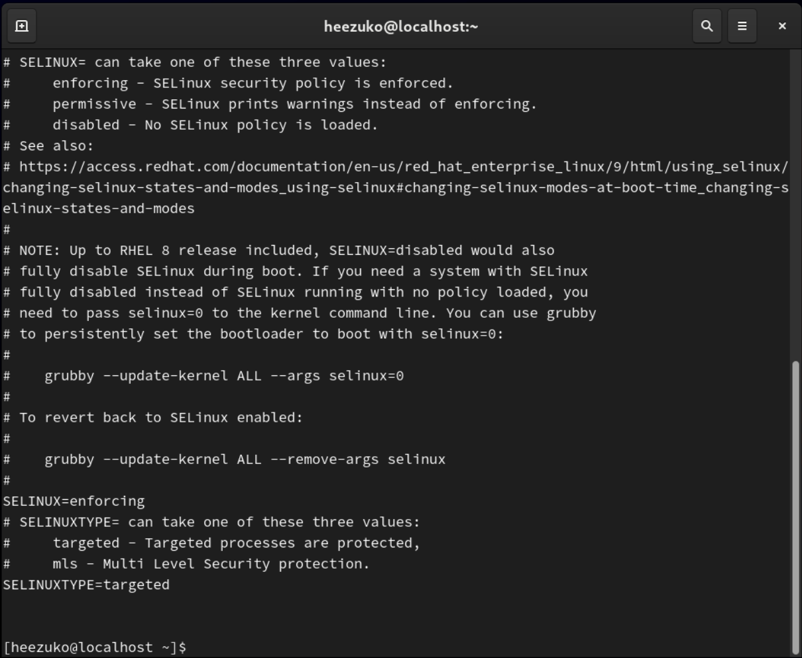

#### 2-5. Context

SELinux는 모든 객체를 **context(보안 레이블)**로 관리함

- 확인
  <pre>ls -Z</pre>
  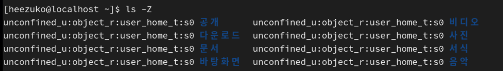

구조: `user : role : type : level`

- SELinux는 **type 기반 접근 제어**를 사용함
- `type`: 파일 type 접근 가능 여부
- ex) `user_home_t`: 사용자 홈 디렉터리

=> 어떤 서버가 읽으려 할 때 권한이 허용이어도 SELinux type이 다르면 접근 차단!

**[Context 문제 해결]**

1. 기본 정책으로 복원
<pre>sudo restorecon -Rv /var/www/html</pre>

2. SELinux 로그 확인
   <pre>sudo ausearch -m AVC,USER_AVC -ts recent</pre>
   <pre>sudo journalctl | grep -i selinux</pre>
   - AVC 메시지 = 접근 차단 로그

3. 일부 기능 ON/OFF로 제어

- 확인
    <pre>getsebool -a</pre>
- 활성화
    <pre>// 웹 서버가 외부 네트워크 연결 가능하도록 ON
  sudo setsebool -P httpd_can_network_connect on</pre>
  - 자주 쓰는 Boolean
    | Boolean | 의미 |
    | ------------------------- | ---------------------- |
    | httpd_can_network_connect | 웹 서버 외부 통신 허용 |
    | httpd_enable_homedirs | 홈 디렉터리 접근 허용 |
