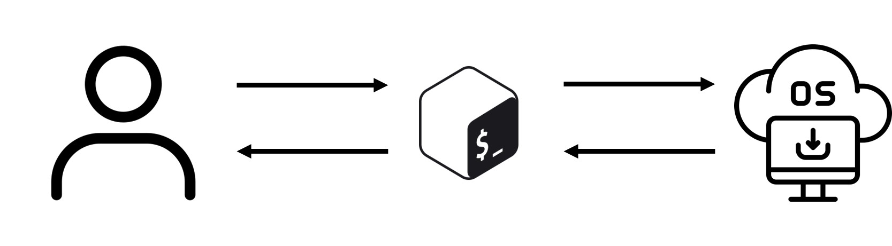

# Week 6

PR 여부: X
진행 상태: 진행중

## Week 6 : 셸 스크립트 및 자동화 기초

<aside>

Bash 셸의 기본 구조 이해, 변수와 환경 변수 활용, 표준 입력·출력·리다이렉션과 파이프 처리, 조건문과 반복문을 활용한 기초 스크립트 작성, 간단한 관리 작업 자동화 실습

</aside>

## 1. Bash 셸이 뭐고 왜 배우는가

## Shell이란?



- Unix 기반 운영체제에서 사용하는
- **사용자**와 **운영체제** 사이의 **인터페이스**로서 작동함
- 사용자로부터 명령을 받아서 운영체제에게 전달하고, 그 결과를 사용자에게 다시 보여주는 역할

Bash는 리눅스와 유닉스 계열 시스템에서 가장 널리 쓰이는 command-line shell 중 하나다. 사용자는 Bash를 통해 운영체제에 명령을 내리고, 파일을 다루고, 프로그램을 실행하고, 여러 작업을 자동화할 수 있다. 단순히 명령어를 입력하는 도구가 아니라, 변수, 조건문, 반복문, 함수, 입출력 제어를 갖춘 스크립트 언어이기도 하다. 그래서 Bash를 배우면 서버 관리, 로그 처리, 파일 정리, 백업, 배치 작업 같은 반복 업무를 빠르게 자동화할 수 있다.

*결과적으로 말하면 Bash는 Shell의 한 종류이다.*

쉘은 일반적으로 CLI형(명령줄 인터페이스) 과 GUI형(그래픽 인터페이스)으로 나뉜다. 배쉬는 이 프로그램 중 하나이며 CLI로 분류된다. 배쉬와 쉘이 같은 개념처럼 보이지만, 배쉬는 쉘이 하위개념인 셈이다.

리눅스와 맥에서는 기본적으로 배쉬를 실행할 수 있지만, 윈도우에서는 gitBash를 따로 설치해야 한다.

---

## 셸 스크립트

> 셸 환경에서 실행할 수 있는 명령어와 스크립트 언어의 구조(조건문, 반복문)를 나열해 놓은 것
> 
- 셸 스크립트는 텍스트 파일로 저장되며, 특정 쉘에서 해석되어 실행
- 스크립트의 첫 줄에는 주로 **해시뱅 (shebang)** **`#!/bin/sh`** 또는 **`#!/bin/bash`**와 같은 구문이 포함되어, 해당 스크립트가 어떤 쉘에서 실행될지를 지정할 수 있다고 한다.

## 2. Bash 셸의 기본 구조 이해


커널과 관련하여 [Linux](https://www.redhat.com/ko/topics/linux) 시스템은 다음과 같은 3개 레이어로 구성되어 있다고 볼 수 있습니다.

1. **하드웨어:** 시스템의 토대가 되는 물리적 머신으로, 메모리(RAM)와 프로세서 또는 중앙 처리 장치(CPU) 그리고 입출력(I/O) 장치(예: [스토리지](https://www.redhat.com/ko/topics/data-storage), [네트워킹](https://www.redhat.com/ko/topics/hyperconverged-infrastructure/what-is-software-defined-networking) 및 그래픽)로 구성됩니다. CPU는 계산을 수행하고 메모리를 읽고 씁니다.
2. **Linux 커널:** OS의 핵심입니다. (보시다시피 한가운데에 있습니다.) 메모리에 상주하며 CPU에 명령을 내리는 소프트웨어입니다.
3. **사용자 프로세스:** 실행 중인 프로그램으로, 커널이 [관리](https://www.redhat.com/ko/topics/management)합니다. 사용자 프로세스가 모여 사용자 공간을 구성합니다. 사용자 프로세스를 단순히 *프로세스*라고도 합니다. 또한, 커널은 이러한 프로세스 및 서버가 서로 통신(프로세스 간 통신 또는 IPC라고 함)할 수 있도록 해줍니다.

### 2-1. 셸과 커널의 관계

운영체제의 핵심은 커널(kernel)이다. 

커널이라는 이름은 단단한 껍질 안의 씨앗처럼 OS 내에 위치하고 전화기, 노트북, 서버 또는 컴퓨터 유형에 관계없이 하드웨어의 모든 주요 기능을 제어하기 때문에 붙은 이름이다.

커널은 프로세스, 메모리, 파일 시스템, 장치 등을 직접 관리한다. 

### 커널의 기능

커널은 다음과 같은 4가지 기능을 수행합니다.

1. **메모리 관리:** 메모리가 어디에서 무엇을 저장하는 데 얼마나 사용되는지를 추적합니다.
2. **프로세스 관리:** 어느 프로세스가 중앙 처리 장치(CPU)를 언제 얼마나 오랫동안 사용할지를 결정합니다.
3. **장치 드라이버:** 하드웨어와 프로세스 사이에서 중재자/인터프리터의 역할을 수행합니다.
4. **시스템 호출 및 보안:** 프로세스의 서비스 요청을 수신합니다.

시스템에서 실행되는 코드는 CPU 상에서 크게 커널 모드(kernel mode)와 사용자 모드(user mode) 중 하나로 동작한다. 커널 모드에서 실행되는 코드는 하드웨어와 메모리에 광범위하게 접근할 수 있지만, 사용자 모드에서 실행되는 코드는 직접적인 하드웨어 제어와 민감한 메모리 접근이 제한된다. 사용자 프로그램이 운영체제 기능을 사용하려면 임의로 자원에 접근하는 것이 아니라 시스템 콜(system call)을 통해 커널에 요청해야 한다. 메모리 역시 이에 대응해 커널 공간(kernel space)과 사용자 공간(user space)으로 구분되며, 이 분리는 운영체제의 안정성과 보안을 유지하는 핵심 기반이 된다.

이러한 구분은 보안뿐 아니라 권한 분리, 컨테이너 격리, 가상 머신 구조 같은 복잡한 시스템 설계의 토대가 된다. 사용자 공간에서 실행되는 프로세스가 실패하더라도 그 영향은 일반적으로 해당 프로세스에 국한되며, 운영체제가 이를 격리하고 정리할 수 있다. 반면 커널 공간에서 동작하는 코드에 문제가 생기면 시스템 전체 메모리와 프로세서 자원에 영향을 줄 수 있으므로, 심한 경우 운영체제 전체가 중단될 수 있다. 즉, 사용자 모드와 커널 모드의 분리는 단순한 실행 방식의 차이가 아니라, 시스템 전체의 안정성과 신뢰성을 보장하는 핵심 메커니즘이다.

사용자는 보통 커널과 직접 대화하지 않고 셸(shell)을 통해 명령을 전달한다. 즉, 셸은 사용자와 운영체제 사이의 인터페이스다.

흐름은 보통 이렇게 이해하면 된다.

사용자 명령 입력 → 셸이 해석 → 필요한 프로그램 실행 → 결과 출력

예를 들어 `ls -l`을 입력하면 Bash가 `ls` 프로그램을 찾아 실행하고, `-l` 옵션을 전달한 뒤, 그 결과를 화면에 보여준다.

### 2-2. Bash 명령어의 기본 형태

일반적인 명령어 구조는 아래와 같다.

```bash
command [option] [argument]
```

예시:

```bash
ls -l /home 
cp file1.txt backup.txt
mkdir mydir
```

여기서:

- `command`: 실행할 명령
- `option`: 명령의 동작 방식을 바꾸는 옵션
- `argument`: 명령의 대상

리눅스의 파일 시스템은 트리 자료구조 형태로 구성되어 있다. 때문에 상위 노드와 하위 노드를 명령어를 통해 쉽게 넘나들 수 있다. 루트 노드는 '/'로 생성되어 있다.

### 2-3. 절대경로와 상대경로

Bash에서는 파일 위치를 경로(path)로 표현한다.

절대경로는 루트 `/`부터 시작한다.

```bash
/home/user/file.txt
```

상대경로는 현재 디렉터리를 기준으로 한다.

```bash
./file.txt
../file.txt
```

자주 쓰는 특수 경로:

- `.` : 현재 디렉터리
- `..` : 상위 디렉터리
- `~` : 현재 사용자 홈 디렉터리

### 2-4. 자주 쓰는 기본 명령어

```bash
[사용자/시스템]
whoami    # 현재 사용자 확인
date      # 현재 날짜/시간 확인

[경로/디렉터리]
pwd       # 현재 위치 확인
ls        # 목록 보기
ls -al    # 현재 디렉터리의 모든 파일을 자세한 정보와 함께 출력
cd        # 디렉터리 이동
.         # 현재 디렉터리
..        # 상위 디렉터리
~         # 내 홈 디렉터리
~user     # user의 홈 디렉터리
mkdir     # 디렉터리 생성
rmdir     # 빈 디렉터리 삭제

[파일]
touch     # 빈 파일 생성
cat       # 파일 내용 출력
less      # 파일 페이지 단위 조회
cp        # 복사
mv        # 이동/이름 변경
rm        # 삭제
echo      # 문자열 출력

[디스크/시스템]
du        # 사용량 확인
df        # 파일시스템 사용량 확인
mount     # 마운트

[권한/링크]
chmod     # 권한 변경
ln        # 하드 링크 생성
ln -s     # 심볼릭 링크 생성
```

예시:

```bash
pwd               # 현재 내가 있는 디렉터리 경로 출력
ls -al            # 현재 디렉터리의 모든 파일을 자세한 정보와 함께 출력
cd /var/log       # /var/log 디렉터리로 이동
mkdir testdir     # testdir 이라는 새 디렉터리 생성
echo "hello bash" # hello bash 문자열 출력
```

### 2-5. Bash에서 중요한 해석 요소

Bash는 입력한 문자열을 그대로 보는 게 아니라 해석해서 실행한다. 이때 중요한 개념이 있다.

### 공백

공백은 토큰 구분자로 사용된다.

```bash
echo hello world
```

이건 `echo` 명령에 `hello`, `world` 두 개의 인자를 준 것이다.

### 따옴표

```bash
name="chaewon"    # name 변수에 문자열 chaewon 저장
age=25            # age 변수에 숫자 25 저장

echo "$name"      # name 변수에 저장된 값 출력
echo "$age"       # age 변수에 저장된 값 출력
```

차이:

- `" "` : 변수 치환이 일어남
- `' '` : 변수 치환이 일어나지 않음

즉,

```bash
echo "$name" # name 변수에 저장된 값 출력
```

는 `chaewon` 출력,

```bash
echo '$name' # age 변수에 저장된 값 출력
```

는 문자 그대로 `$name` 출력

### 명령 치환

명령 실행 결과를 문자열처럼 사용할 수 있다.

```bash
today=$(date)
echo "$today"
```

---

## 3. 변수와 환경 변수 활용

### 3-1. 셸 변수란

Bash에서 변수는 값을 저장하는 이름이다.

```bash
name="chaewon"
age=25
```

주의할 점:

- `=` 양옆에 공백이 있으면 안 된다.
- 문자열도 따옴표 없이 넣을 수 있지만, 공백이 있으면 따옴표가 필요하다.

출력:

```bash
echo "$name"
echo "$age"
```

### 3-2. 변수 사용 예시

```bash
filename="report.txt"                 # filename 변수에 파일명 저장
echo "파일 이름은 $filename 이다."     # 변수값을 문자열 안에 포함해서 출력
cp "$filename" backup_"$filename"     # report.txt를 backup_report.txt로 복사
```

중괄호를 쓰면 경계가 명확해진다.

```bash
name="kim"          # name 변수에 kim 저장
echo "${name}123"   # 변수 name 뒤에 123을 붙여서 kim123 출력
```

### 3-3. 읽기 전용 입력 받기

사용자로부터 값을 입력받으려면 `read`를 사용한다.

```bash
read username                 # 사용자로부터 값을 입력받아 username 변수에 저장
echo "입력한 이름: $username"  # 방금 입력한 값 출력
```

프롬프트를 같이 줄 수도 있다.

```bash
read -p "이름을 입력하세요: " username   # 프롬프트를 보여주고 username에 입력값 저장
echo "안녕하세요, $username"             # 입력받은 이름으로 인사 출력
```

### 3-4. 환경 변수란

환경 변수(environment variable)는 현재 셸뿐 아니라 그 셸에서 실행되는 하위 프로세스에도 전달되는 변수다. 프로그램 실행 환경을 설정하는 데 사용된다.

대표적인 환경 변수:

- `HOME`: 사용자 홈 디렉터리
- `PATH`: 실행 파일을 찾는 디렉터리 목록
- `USER`: 사용자 이름
- `PWD`: 현재 작업 디렉터리
- `SHELL`: 현재 사용하는 셸

확인:

```bash
echo "$HOME"   # 현재 사용자의 홈 디렉터리 경로 출력
echo "$PATH"   # 명령어 탐색 경로 목록 출력
env            # 현재 설정된 환경 변수 전체 출력
```

### 3-5. 일반 변수와 환경 변수 차이

일반 변수:

```bash
myvar="hello" 
```

현재 셸 안에서만 사용 가능

환경 변수:

```bash
export myvar="hello" 
```

현재 셸 + 자식 프로세스에서 사용 가능

예시:

```bash
myvar="local"                                   # 일반 변수 myvar 선언
export envvar="global"                          # 환경 변수 envvar 선언 및 export
bash -c 'echo "myvar=$myvar, envvar=$envvar"'   # 새 Bash 프로세스에서 두 변수 출력 시도
# 결과: export하지 않은 myvar는 안 보일 수 있고, envvar는 보임
```

결과에서 `myvar`는 안 보이고 `envvar`는 보일 수 있다. 이유는 `export`된 변수만 자식 프로세스에 전달되기 때문이다.

### 3-6. PATH 이해

`PATH`는 명령어 실행 시 어디서 프로그램을 찾을지 알려주는 환경 변수다.

```bash
echo "$PATH"   # PATH 환경 변수 출력
```

보통 `:`로 여러 디렉터리가 구분되어 있다. 예를 들어 `/bin:/usr/bin:/usr/local/bin` 같은 식이다.

Bash가 `ls`를 실행할 때는 PATH에 있는 디렉터리들을 순서대로 뒤져서 실행 파일을 찾는다.

명령어 위치 확인:

```bash
which ls       # ls 명령어 실행 파일 위치 출력
type ls        # ls가 외부 명령인지, alias인지, builtin인지까지 확인
```

---

## 4. 표준 입력·출력·리다이렉션과 파이프 처리

### 4-1. 표준 입력과 출력 개념

모든 프로세스는 기본적으로 세 가지 표준 스트림을 가진다.

- 표준 입력(stdin): 파일 디스크립터 0
- 표준 출력(stdout): 파일 디스크립터 1
- 표준 에러(stderr): 파일 디스크립터 2

기본적으로:

- stdin은 키보드
- stdout은 화면
- stderr도 화면

### 리다이렉션

**리다이렉션**은 셸에서 표준 입출력 스트림을 다른 방향으로 전환하는 기능을 말한다. Bash 셸에서는 기본적으로 세 가지 주요 스트림이 존재한다.

- **표준 입력(stdin) : 파일 디스크립터 번호 0**
- **표준 출력(stdout) : 파일 디스크립터 번호 1**
- **표준 오류 출력(stderr) : 파일 디스크립터 번호 2**

리다이렉션을 사용하면 이러한 스트림을 파일이나 다른 스트림으로 변경할 수 있다.

### **리다이렉션 연산자**

리다이렉션은 명령어의 입력과 출력을 파일이나 다른 명령어로 연결하는 데 사용된다. 리다이렉션은 셸에서 제공하는 강력한 기능으로, 표준 입출력을 다루는 중요한 도구이다.

### 4-2. 출력 리다이렉션

### `>`

- **> (덮어쓰기)**
    - 명령어의 표준 출력(stdout)을 지정된 파일로 저장한다.
    - 파일이 존재하면 덮어쓰기가 이루어진다.
    - output.txt 파일에 "Hello, world"가 저장된다.
    - 기존 output.txt 파일의 내용이 삭제되고 새로 작성된다. (덮어쓰기)

표준 출력을 파일에 덮어쓴다.

```bash
echo "hello" > out.txt # hello를 out.txt에 저장, 기존 내용은 덮어씀
```

### `>>`

- **>> (추가)**
    - 명령어의 표준 출력(stdout)을 지정된 파일에 추가한다.
    - 파일이 존재하면 내용을 유지한 채 뒤에 추가한다.
    - 파일이 없으면 새로 생성한다.
    - output.txt 파일에 "Appended Line"이 추가된다.

표준 출력을 파일 끝에 이어 붙인다.

```bash
echo "world" >> out.txt  # world를 out.txt 맨 뒤에 추가
```

### 4-3. 입력 리다이렉션

`<`는 파일 내용을 표준 입력으로 넘긴다.

- **<**
    - 파일의 내용을 명령어의 표준 입력(stdin)으로 전달한다.
    - input.txt 파일의 내용을 cat 명령어로 읽어와서 출력한다.

```bash
wc -l < out.txt
```

### 4-4. 에러 리다이렉션

표준 에러만 따로 파일로 보낼 수 있다.

- **2> (표준 에러 출력 덮어쓰기)**
    - 명령어의 표준 에러(stderr)를 지정한 파일로 저장한다.

```bash
ls /notexist 2> error.txt
```

- **2>> (표준 에러 출력 추가)**
    - 표준 에러(stderr)를 지정한 파일에 추가한다.

```bash
ls nonexistentfield 2>> error.log
```

표준 출력과 표준 에러를 함께 저장:

```bash
command > all.txt 2>&1    # 표준 출력(stdout)과 표준 에러(stderr)를 모두 all.txt에 저장
# > all.txt  : stdout(1번)을 all.txt로 보냄
# 2>&1       : stderr(2번)도 stdout(1번)이 가는 곳과 같은 곳으로 보냄
```

의미:

- `>` : stdout을 all.txt로 보냄
- `2>&1` : stderr도 stdout이 가는 곳과 같은 곳으로 보냄

Bash에서는 아래처럼 더 간단히 쓸 수도 있다.

```bash
command &> all.txt        # stdout과 stderr를 둘 다 all.txt로 보내는 Bash 축약 문법
```

#### 리다이렉션 대상 없애기

```bash
command > /dev/null 2>&1  # 표준 출력과 표준 에러를 모두 버림
# /dev/null은 출력 내용을 버리는 특수 파일
```

- **/dev/null**
    - /dev/null은 리눅스의 블랙홀로, 데이터를 쓰면 그대로 버려진다.
    - 출력을 원치 않을 때 사용하면 된다.
    - 표준 출력과 표준 에러를 모두 /dev/null로 보내서 버린다.
    - 결과적으로 아무런 출력도 표시되지 않는다.

### 4-5. 파이프 `|`

여러 명령을 연결하여 한 명령의 출력을 다음 명령의 입력으로 사용하는 강력한 기능입니다. 이 기능을 사용하면 복잡한 작업을 여러 개의 간단한 명령으로 분할하여 처리할 수 있으며, 효율적이고 유연한 데이터 처리를 가능하게 합니다. 

파이프라인은 쉘에서 `|` (파이프) 기호를 사용하여 구현됩니다.
파이프라인은 두 개 이상의 명령을 연결하여, 앞 명령의 표준 출력(standard output, `stdout`)을 뒤 명령의 표준 입력(standard input, `stdin`)으로 전달하는 방식입니다. 이를 통해 여러 명령을 조합하여 강력한 데이터 처리 흐름을 만들 수 있습니다.

파이프는 한 명령의 표준 출력을 다음 명령의 표준 입력으로 연결한다.

```bash
ls -l | grep ".txt"       # ls -l 결과를 grep에 넘겨서 .txt가 포함된 줄만 출력
```

흐름:

- `ls -l` 결과를 화면에 직접 보여주지 않고
- `grep ".txt"`의 입력으로 전달
- `.txt`가 포함된 줄만 출력

다른 예시:

```bash
cat access.log | grep "ERROR"   # access.log에서 ERROR가 있는 줄만 출력
ps aux | grep nginx             # 현재 프로세스 목록 중 nginx 관련 줄만 출력
df -h | grep "/dev"             # 디스크 사용량 정보 중 /dev가 포함된 줄만 출력
```

### 4-6. 리다이렉션과 파이프를 함께 쓰기

```bash
cat access.log | grep "ERROR" > error_lines.txt
```

로그에서 ERROR가 포함된 줄만 골라서 파일로 저장

### 4-7. tee 명령어

출력을 화면에도 보여주고 파일에도 저장하고 싶을 때 `tee`를 쓴다.

```bash
ls -l | tee result.txt   # 결과를 화면에도 보여주고 result.txt에도 저장
```

### 4-8. 핵심 차이 정리

리다이렉션은 “입출력 방향을 파일 등으로 바꾸는 것”이고, 파이프는 “한 명령의 출력 결과를 다른 명령의 입력으로 연결하는 것”이다.

예:

```bash
echo "hello" > file.txt
cat file.txt | wc -c
```

첫 줄은 출력 방향을 파일로 바꾼 것, 둘째 줄은 한 명령의 결과를 다른 명령으로 넘긴 것이다.

---

*출처: [https://velog.io/@ttanggin/ShellBash](https://velog.io/@ttanggin/ShellBash),* [https://www.redhat.com/ko/topics/linux/what-is-the-linux-kernel](https://www.redhat.com/ko/topics/linux/what-is-the-linux-kernel), [https://velog.io/@dong98/Linux-Bash란-배쉬와-기본-명령어](https://velog.io/@dong98/Linux-Bash%EB%9E%80-%EB%B0%B0%EC%89%AC%EC%99%80-%EA%B8%B0%EB%B3%B8-%EB%AA%85%EB%A0%B9%EC%96%B4)

## 5. 조건문과 반복문을 활용한 기초 스크립트 작성

## 5-1. Bash 스크립트 기본 형식

Bash 스크립트는 여러 명령을 파일에 저장해 한 번에 실행하는 것이다.

예시:

```bash
#!/bin/bash         # 이 스크립트를 /bin/bash 인터프리터로 실행하라는 뜻(shebang)

echo "Hello Bash"   # 문자열 출력
date                # 현재 날짜와 시간 출력
pwd                 # 현재 작업 디렉터리 출력
```

이 파일을 `test.sh`로 저장한 뒤 실행 권한을 준다.

```bash
chmod +x test.sh    # test.sh 파일에 실행 권한 부여
./test.sh           # 현재 디렉터리의 test.sh 스크립트 실행
```

첫 줄 `#!/bin/bash`는 이 파일을 Bash로 실행하라는 뜻이다. 이를 shebang(# + !)이라고 한다.

### 5-2. 조건문 if

```bash
# 숫자 비교 연산자
-eq   # equal: 같다
-ne   # not equal: 같지 않다
-gt   # greater than: 크다
-ge   # greater than or equal: 크거나 같다
-lt   # less than: 작다
-le   # less than or equal: 작거나 같다
```

기본 구조:

```bash
if [ 조건 ]; then
    실행문
fi
```

예시:

```bash
#!/bin/bash

read -p "숫자를 입력하세요: " num

if [ "$num" -gt 10 ]; then //gt = greater than
    echo "10보다 큼"
fi
```

### 5-3. if-else

```bash
#!/bin/bash

read -p "숫자를 입력하세요: " num

if [ "$num" -gt 10 ]; then
    echo "10보다 큼"
else
    echo "10 이하"
fi
```

### 5-4. elif

```bash
#!/bin/bash

read -p "점수를 입력하세요: " score   # 점수 입력받기

if [ "$score" -ge 90 ]; then         # score가 90 이상이면
    echo "A"                         # A 출력
elif [ "$score" -ge 80 ]; then       # 그렇지 않고 80 이상이면
    echo "B"                         # B 출력
elif [ "$score" -ge 70 ]; then       # 그렇지 않고 70 이상이면
    echo "C"                         # C 출력
else                                 # 위 조건 모두 아니면
    echo "F"                         # F 출력
fi
```

### 5-5. 조건 비교 연산자

문자열 비교:

- `=` : 같다
- `!=` : 다르다
- `z` : 문자열 길이가 0
- `n` : 문자열 길이가 0이 아님

파일 검사:

- `f file` : 일반 파일
- `d file` : 디렉터리
- `e file` : 존재 여부
- `r file` : 읽기 가능
- `w file` : 쓰기 가능
- `x file` : 실행 가능

예시:

```bash
if [ -f "data.txt" ]; then
    echo "파일 존재"
fi
```

### 5-6. 반복문 for

```bash
for 변수 in 값목록
do
    실행문
done
```

예시:

```bash
for i in 1 2 3 4 5
do
    echo "$i"
done
```

범위 표현:

```bash
for i in {1..5}
do
    echo "$i"
done
```

파일 목록 순회:

```bash
for file in *.txt
do
    echo "파일: $file"
done
```

### 5-7. 반복문 while

```bash
count=1
while [ "$count" -le 5 ]
do
    echo "$count"
    count=$((count + 1))
done
```

### 5-8. case 문

여러 문자열 분기 처리에 유용하다.

```bash
read -p "과일 이름 입력: " fruit

case "$fruit" in
    apple)
        echo "사과 선택"
        ;;
    banana)
        echo "바나나 선택"
        ;;
    *)
        echo "기타 과일"
        ;;
esac
```

### 5-9. 위치 매개변수

스크립트 실행 시 전달한 인자를 사용할 수 있다.

```bash
#!/bin/bash
echo "첫 번째 인자: $1"   # 실행 시 전달한 첫 번째 인자 출력
echo "두 번째 인자: $2"   # 실행 시 전달한 두 번째 인자 출력
echo "전체 인자 수: $#"   # 전달한 전체 인자 개수 출력
echo "전체 인자 목록: $@" # 전달한 전체 인자 목록 출력
```

실행:

```bash
./arg.sh hello world   # hello는 $1, world는 $2로 전달됨
```

### 5-10. 종료 상태 코드

리눅스 명령은 성공/실패를 종료 코드로 남긴다.

- `0` : 성공
- 0이 아닌 값 : 실패

직전 명령의 종료 상태는 `$?`로 확인 가능

```bash
ls /tmp        # /tmp 디렉터리 내용 출력 시도
echo $?        # 바로 직전 명령의 종료 상태 코드 출력

ls /notexist   # 존재하지 않는 경로 접근 시도
echo $?        # 실패했으므로 0이 아닌 종료 코드 출력
```

조건문에서는 이 종료 코드가 자주 활용된다.

```bash
if grep "hello" file.txt > /dev/null 2>&1; then   # hello가 file.txt 안에 있으면
    echo "찾음"                                   # 성공 시 출력
else                                              # 없으면
    echo "없음"                                   # 실패 시 출력
fi
```

---

## 6. 스크립트 작성 시 꼭 알아야 할 실전 문법

### 6-1. 산술 연산

```bash
a=10
b=3
sum=$((a + b))
echo "$sum"
```

### 6-2. 주석

```bash
# 이 줄은 주석이다
```

### 6-3. 명령어 성공 여부에 따른 처리

```bash
mkdir backup && echo "생성 성공"
rm temp.txt || echo "삭제 실패"
```

의미:

- `&&` : 앞 명령 성공 시 뒤 명령 실행
- `||` : 앞 명령 실패 시 뒤 명령 실행

### 6-4. 함수

```bash
#!/bin/bash

say_hello() {
    echo "안녕하세요, $1"
}

say_hello "차원"
```

### 6-5. 안전한 스크립트 습관

실전에서는 아래를 습관적으로 고려하는 게 좋다.

```bash
#!/bin/bash
set -e
set -u
```

의미:

- `set -e`: 명령 실패 시 스크립트 중단
- `set -u`: 선언되지 않은 변수 사용 시 에러

조금 더 자주 쓰는 형태:

```bash
set -euo pipefail
```

`pipefail`은 파이프라인 중간에 실패한 명령도 실패로 간주하게 한다.

---

## 7. 간단한 관리 작업 자동화 실습

여기부터가 스터디에서 중요한 부분이다. 단순 문법 말고 “실제로 어디에 쓰는지”가 보여야 한다.

## 실습 1. 현재 시스템 정보 출력 스크립트

목적: 날짜, 사용자, 현재 디렉터리, 디스크 사용량 확인

```bash
#!/bin/bash

echo "현재 날짜: $(date)"              # date 명령 결과를 문자열처럼 넣어 출력
echo "현재 사용자: $USER"              # USER 환경 변수 출력
echo "홈 디렉터리: $HOME"             # HOME 환경 변수 출력
echo "현재 작업 디렉터리: $(pwd)"     # pwd 명령 결과 출력
echo "디스크 사용량:"                  # 안내 문구 출력
df -h                                 # 사람이 읽기 쉬운 형식으로 디스크 사용량 출력
```

설명:

- `$(date)`로 현재 날짜 명령 결과를 문자열처럼 사용
- 환경 변수 `$USER`, `$HOME` 사용
- `df -h`는 디스크 사용량을 사람이 읽기 쉬운 형식으로 출력


---

## 실습 2. 디렉터리 존재 여부 확인 후 생성

목적: 관리용 폴더가 없으면 자동 생성

```bash
#!/bin/bash

target_dir="backup"                       # 생성하거나 확인할 디렉터리 이름 저장

if [ -d "$target_dir" ]; then            # backup 디렉터리가 이미 존재하면
    echo "$target_dir 디렉터리가 이미 존재함"
else                                     # 존재하지 않으면
    mkdir "$target_dir"                  # 디렉터리 생성
    echo "$target_dir 디렉터리 생성 완료"
fi
```

설명:

- `d`는 디렉터리 존재 여부 확인
- 없을 경우 `mkdir` 실행

---

## 실습 3. 로그 파일에서 특정 문자열 검색

목적: 에러 로그만 뽑아서 별도 저장

```bash
#!/bin/bash

logfile="system.log"                      # 원본 로그 파일 이름
outfile="error.log"                       # 결과를 저장할 파일 이름

if [ -f "$logfile" ]; then                # logfile이 일반 파일이면
    grep "ERROR" "$logfile" > "$outfile"  # ERROR가 포함된 줄만 골라 outfile에 저장
    echo "ERROR 로그를 $outfile 에 저장함"
else                                      # logfile이 없으면
    echo "$logfile 파일이 존재하지 않음"
fi
```

설명:

- `grep "ERROR"`로 특정 패턴 검색
- `>`로 결과를 파일에 저장


---

## 실습 4. 여러 txt 파일 개수 세기

목적: 특정 파일 타입 현황 파악

```bash
#!/bin/bash

count=0                                  # txt 파일 개수를 저장할 변수 초기화

for file in *.txt                        # 현재 디렉터리의 모든 .txt 파일 순회
do
    if [ -f "$file" ]; then              # 실제 일반 파일이면
        count=$((count + 1))             # count를 1 증가
    fi
done

echo "txt 파일 개수: $count"            # 최종 개수 출력
```

설명:

- `for`로 파일 목록 순회
- `f`로 일반 파일 여부 검사
- 산술 연산으로 개수 누적


---

## 실습 5. 사용자 입력 기반 백업 스크립트

목적: 특정 파일을 backup 디렉터리에 복사

```bash
#!/bin/bash

read -p "백업할 파일 이름을 입력하세요: " filename   # 백업할 파일 이름 입력받기

backup_dir="backup"                                  # 백업 디렉터리 이름 저장

if [ ! -d "$backup_dir" ]; then                      # backup 디렉터리가 없으면
    mkdir "$backup_dir"                              # backup 디렉터리 생성
fi

if [ -f "$filename" ]; then                          # 입력한 파일이 실제로 존재하면
    cp "$filename" "$backup_dir/"                    # backup 디렉터리로 복사
    echo "$filename 백업 완료"
else                                                 # 존재하지 않으면
    echo "$filename 파일이 존재하지 않음"
fi
```

설명:

- 입력받은 파일 이름을 검사
- backup 디렉터리가 없으면 생성
- 파일이 있으면 복사


---

## 실습 6. CPU/메모리/디스크 간단 점검 스크립트

목적: 관리 작업 자동화의 가장 기초적인 형태

```bash
#!/bin/bash

echo "===== 시스템 점검 시작 ====="                 # 시작 메시지 출력
echo "날짜: $(date)"                               # 현재 날짜 출력
echo                                                # 빈 줄 출력

echo "[1] 메모리 사용량"                            # 섹션 제목 출력
free -h                                             # 사람이 읽기 쉬운 형식으로 메모리 사용량 출력
echo

echo "[2] 디스크 사용량"                            # 섹션 제목 출력
df -h                                               # 디스크 사용량 출력
echo

echo "[3] 현재 실행 중인 상위 프로세스"             # 섹션 제목 출력
ps aux --sort=-%mem | head -n 6                     # 메모리 사용량 기준 상위 6개 프로세스 출력
echo

echo "===== 시스템 점검 종료 ====="                 # 종료 메시지 출력
```

설명:

- `free -h`: 메모리 사용량 확인
- `df -h`: 디스크 사용량 확인
- `ps aux --sort=-%mem | head -n 6`: 메모리 많이 쓰는 프로세스 상위 출력
- 파이프를 이용해 `ps` 결과를 `head`로 연결


---
